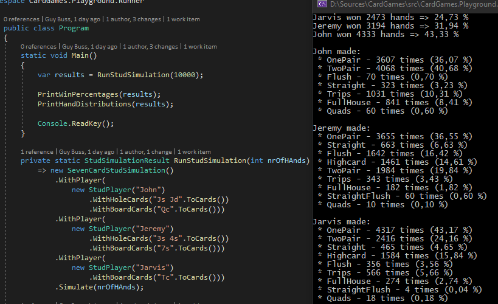
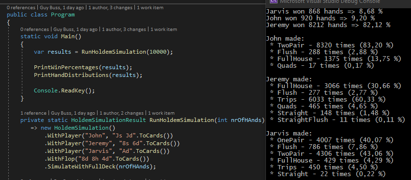

# CardGames
### Introduction
After writing simulations and tools for card games (poker in particular) in the last years, I have decided to take a step back, sort through the code bases, clean up here and there, and distill out small, reusable packages that hopefully can be useful for the open source community.

### About the project
I assume this project will be slow, because of several reasons. First of all, it is a pure leisure project. Secondly, because I value design. I try to model the entities and their apis as closely as possible to the real world concepts they represent (albeit adding some convenience apis if they are very useful).

I value code quality and readability a lot as well. I'll spend lots of time rewriting algorithmically simple things if I feel I can express them even cleaner. And finally, I also am a big believer in unit tests, especially when writing libraries. You put yourself in the role of a client and try to interact with the entities the library provides. They not only provide confidence that everything works the way it should, they make you really think about the design an usability of the entities the library provides. 

# CardGames.Core
There are thousands of different [card games](https://en.wikipedia.org/wiki/Card_game), with many different cards and collections of cards, with different rules and purposes. 

In this package, we tried to follow a domain-driven approach to card games in general<sup>1</sup>. 
It contains the basic entities needed for such a game: _Cards_ (duh!), _Card decks_ (which are the finite collections of all possible cards of given type) and _Dealers_.

<sup>1</sup> Actually, up to abuse of language, any game of chance that contains a finite set of possibilities can be modelled using this package, e.g., we can interpret a die as a deck of six cards called: 1,2,3,4,5,6. We can implement a `DiceDealer` who 'shuffles the deck' (i.e. returns the dealt/rolled card/value back to the deck immediately) after dealing a card (rolling the die).

## Card
The most elemental part of a card game is the card. There is actually nothing universal that describes a card, except for it being detemined by it's content. So in all later entities the card will be represented by a generic type `TCard`, with the constraint that it is a **class**. 

> *NOTE: Until recently, `TCard` was generically constrained to be a **struct**. However, I have decided to switch over to **class**, as in all my use-cases, the gain from passing-by-reference as default (in terms of performance) was higher than the benefit of creation on the stack, as they are often passed around into other methods, collections, etc.  Another reason is that the memory allocation needed to create an instance depends heavily on implementation, and might be big, depending on your card deck and game (think: Cards in a deck builder game with lot's of properties).

## Deck
The collection of all different cards, in a bunch, is called a deck.

The package provides a generic interface for a deck which holds cards of the generic type `TCard`
```cs
// Interface definition for a generic deck
public interface IDeck<TCard> where TCard : class
{
    int NumberOfCardsLeft();
    TCard GetFromRemaining(int index);
    TCard GetSpecific(TCard specificCard);
    void Reset();
};
````

## Dealer
The dealer is the entity handling the deck. Instead of only providing an interface like for the deck, the library provides a generic implementation of a dealer, which can be specified (i.e., derived from) in order to add more specific functionality:
```cs
public class Dealer<TCard> where TCard : class
{
    public Dealer(IDeck<TCard> deck) {...}
    public Dealer(IDeck<TCard> deck, IRandomNumberGenerator numberGenerator) {...}

    public TCard DealCard() {...}
    public IReadOnlyCollection<TCard> DealCards(int amount) {...}
    public void Shuffle() {...}
}
````
The dealer can deal one or many cards at once, and shuffle the deck. In order to do that, he needs a deck (duh!). In order to shuffle, he needs some source of randomness. We provide an interface you can implement,
```cs
public interface IRandomNumberGenerator
{
    public int Next(int upperBound);
}
````
and a standand implementation (which is just a wrapper holding an instance of `System.Random`).

# CardGames.Core.French
This library is an implementation of the core library for the arguably the most well-known playing card: the [french-suited playing card](https://en.wikipedia.org/wiki/French-suited_playing_cards).

## French-suited playing cards
A french-suited playing card is characterized by two properties: The _Suit_ (Diamonds, Hearts, Clubs and Spades) and the _Symbol_ (Deuce, Three ... King, Ace), both of which are represented as enums in the library. The _Value_ of the card is a numeric value in bijective relation to it's symbol:
```cs
// Using the Suit and Symbol enum
var card = new Card(Suit.Hearts, Symbol.Deuce);

// Using the Value instead of the Symbol
var card = new Card(Suit.Hearts, 8);
````

### Serialization and Deserilaization
There are conventional string representations for these cards, which we support via extensions (resp. implementing the `ToString()` method):
```cs
// String extension expecting the format {symbol char}{suit char}
var card = "Jc".ToCard();
var serializedCard = card.ToString() // equals "Jc" again.

// String extension expecting the one or more cards separated by a space
var cards = "2h 5d Qs".ToCards();
var serializedCards = cards.ToStringRepresentation(); // equals "2h 5d Qs" again.
````

### Dealing with collections of cards
Since most card games involve players having more than one card, handling collections of cards is needed. We provide several extensions on `IEnumerable<Card>` for convenience:

```cs
// Get cards by descending value
IReadOnlyCollection<Card> ByDescendingValue(this IEnumerable<Card> cards)

// Get values in several flavors
IReadOnlyCollection<int> Values(this IEnumerable<Card> cards)
IReadOnlyCollection<int> DescendingValues(this IEnumerable<Card> cards)
IReadOnlyCollection<int> DistinctDescendingValues(this IEnumerable<Card> cards)

// Get all distinct suits
IReadOnlyCollection<Suit> Suits(this IEnumerable<Card> cards)

// Check if given values are all in the cards
bool ContainsValue(this IEnumerable<Card> cards, int value)
bool ContainsValues(this IEnumerable<Card> cards, IEnumerable<int> valuesToContain)

// Detemines highest value-duplicates
int ValueOfBiggestPair(this IEnumerable<Card> cards) 
int ValueOfBiggestTrips(this IEnumerable<Card> cards)
int ValueOfBiggestQuads(this IEnumerable<Card> cards)
````

## French decks
Of course, as we have provided the french-suited card, we also provide some decks containing these cards in this library.

First of all, there is a base class which provides a few more useful methods already using the fact that a french card has a `Symbol` (resp. `Value`) and a `Suit`. The only thing an implementing class must provide is the collection of _all cards_ in the deck:
```cs
public abstract class FrenchDeck : IDeck<Cards.French.Card>
{
    protected abstract IReadOnlyCollection<Card> Cards();
    public IReadOnlyCollection<Card> CardsLeft() {...}
    public IReadOnlyCollection<Card> CardsLeftOfValue(int value) {...}
    public IReadOnlyCollection<Card> CardsLeftOfSuit(Suit suit) {...}
    public IReadOnlyCollection<Card> CardsLeftWith(Func<Card, bool> predicate) {...}
}
````
There are two implementations in the package:
- `FullFrenchDeck`: The standard 52-card deck consisting of Deuce-to-Ace of all four suits.
- `ShortFrenchDeck`: A 36-card deck consisting of Six-to-Ace of all four suits (like is used in [Short-deck poker](https://en.wikipedia.org/wiki/Six-plus_hold_%27em)).

## French-deck dealer
One could wonder why a dealer cares whyt kind of deck he deals, i.e., why a specific dealer implementation for a given deck makes sense.

In our domain view, the dealer is the owner of the deck, and responsible for dealing the cards. He hence has knowledge about the deck (a dealer can peek if he wants!), and using this knowledge, combined with a specific deck let's us add convenience methods on the dealer. 

The `FrenchDeckDealer` we provide in this package (including two factory methods for the decks we have defined earlier), can peek into the deck and try to narrow down the cards from which he deals the next, randomly:
```cs
// provides a dealer with full deck (or use .WithShortDeck() for a short deck)
var dealer = FrenchDeckDealer.WithfullDeck();

// deals a random card of given value, suit or symbol. 
// Succeeds if there are still some in the deck, else fails.
_ = dealer.TryDealCardOfValue(7, out var card);
_ = dealer.TryDealCardOfSymbol(Symbol.King, out var card);
_ = dealer.TryDealCardOfSuit(Suit.Spades, out var card);
````
This is very useful and increases performance in simulation scenarios where certain specific situations have to be recreated over and over.

# CardGames.Poker

## Hands
The library contains domain models for hands in: 5-card draw, Holdem, Omaha and Stud. 

The Holdem and Omaha hands derive from a more generic hand model called `CommunityCardsHand`, which can be used to model any kind of community card hand (any number of community cards, any number of hole cards, any requirement how many of them have to be used for a hand, and how many must at least be used. So in these parameters, a Holdem hand is (3-5, 2, 0, 2) and a Omaha hand (3-5, 4, 2, 2)). So using this as a basis, it is easy to implement, e.g., 5-card PLO and other lesser known variants.

Hands all implement `IComparable`, and the operators "<, >" are implemented by default. This is accompished by using two properties of the base class of any hand:  
Strength (of type `long`) and Type (e.g. `HandType.Flush`). The calculations of the strength and type are directly performed when constructing the hand, and they are designed in such a fashion that the ordering of the types can be provided as well (because, e.g., in short deck, a flush beats a full-house). The classical orderign as well as the ordering for short-deck poker are provided in the class `HandTypeStrength`.

## Simulations
The library contains models for Holdem (full and short deck) and Stud simulations (currently still in the `CardGames.Playground` project, but they will soon move to the `CardGames.Poker` project), and other simulations can easily be built in similar fashion. Both Simulations are configurable with a fluent builder pattern. Here's an example of a Holdem simulation configuration:
```cs
// any number of players can be added
// each players hole cards can be specified by providing zero, one or two cards
// optionally, a flop/turn/river can be provided
// finally the simulation is executed by calling SimulateWithFullDeck resp. SimulateWithShortDeck
private HoldemSimulationResult RunHoldemSimulation(int nrOfHAnds)
    => new HoldemSimulation()
        .WithPlayer("John", "Js Jd".ToCards())
        .WithPlayer("Jeremy", "8s 6d".ToCards())
        .WithPlayer("Jarvis", "Ad".ToCards()) 
        .WithFlop("8d 8h 4d".ToCards()) 
        .SimulateWithFullDeck(nrOfHAnds);
````

The Stud simulation works similarly. However, since a player has different kinds of cards, one provides any number of `StudPlayers` to the simulation, which have a builder of their own. Here's what that looks like in an example:
````cs
// again, any number of players can be specified
// and each players hole and board cards can be specified individually
private StudSimulationResult RunStudSimulation(int nrOfHAnds)
    => new SevenCardStudSimulation()
        .WithPlayer(
            new StudPlayer("John")
                .WithHoleCards("Js Jd".ToCards())
                .WithBoardCards("Qc".ToCards()))
        .WithPlayer(
            new StudPlayer("Jeremy")
                .WithHoleCards("3s 4s".ToCards())
                .WithBoardCards("7s".ToCards()))
        .WithPlayer(
            new StudPlayer("Jarvis")
                .WithBoardCards("Tc".ToCards()))
        .Simulate(nrOfHAnds);
````

If you want to play around with these simulations, there is a console program in `CardGames.Playground.Runner` where you can run any simulation. It also contains some benchmarks (using [BenchmarkDotNet](https://benchmarkdotnet.org/)), which you can run. In fact, they have been instrumental in finding the right balance between design and performance, big shoutout to them!

The simulation result classes contain a complete collection of all run hands, as well as some predefined queries and aggregations, which can easily be extendend and customized due to the fact that the full collection of hands is available. 

Here is a simple printout of the above Holdem simulation:


Here is a simple printout of the above Stud simulation:



### Disclaimer
:hand: Although this description uses the word _package_ multiple times, it is not yet published as a nuget package, as it is still under development.

## Feedback and Contributing
All feedback welcome!
All contributions are welcome!
